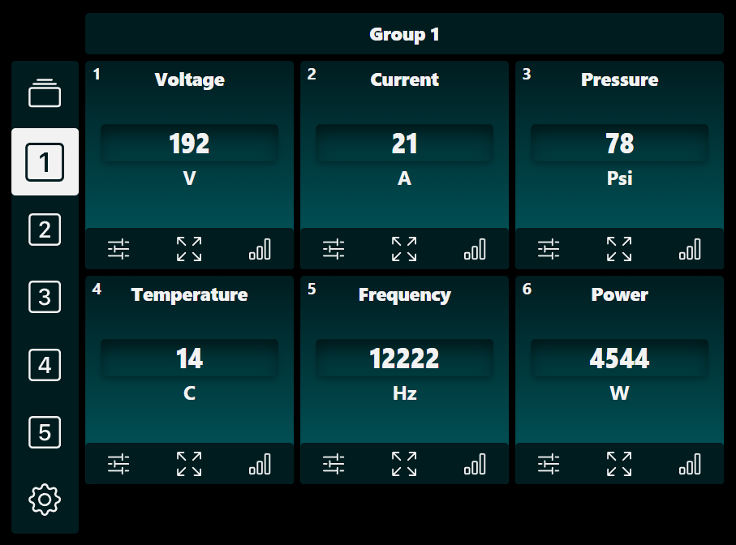
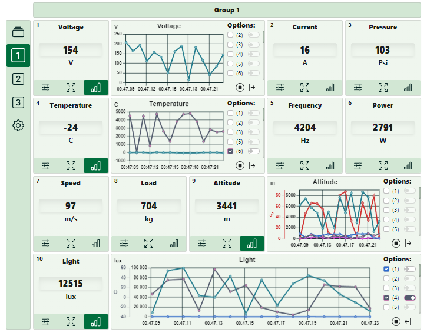
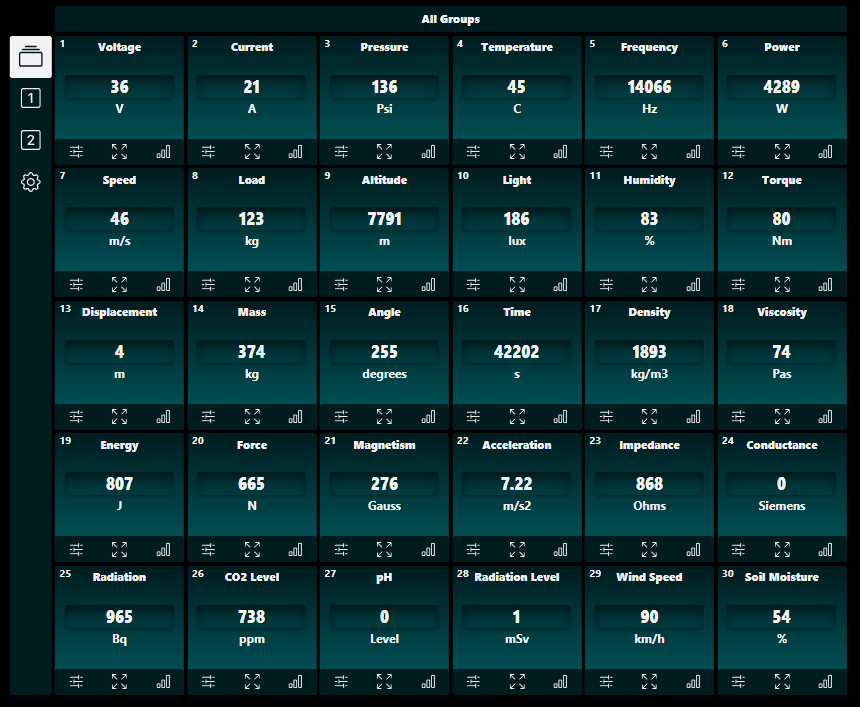
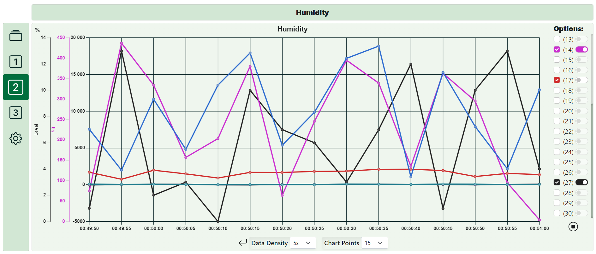

# React Data Visualization App

## Overview
This React application is designed to display a variety of data through interactive charts with extensive customization options. It's ideal for real-time data monitoring and analysis across numerous parameters such as voltage, temperature, humidity, and more.

## Features
- **Dynamic Data Display:** Real-time updates on metrics like voltage, current, pressure, etc.
- **Flexible Layout:** Customize the layout to meet specific needs and device types.
- **Interactive Charts:** Detailed view of data trends over time with interactive line charts.
- **Customization Options:** Various settings for chart customization including colors, line styles, and visibility.

## Screenshots
Below are some screenshots demonstrating the application's capabilities:

  
*Dashboard View: Grouped data metrics display. Dark theme.*

  
*Detailed Metrics View: Historical trends for specific metrics.*

  
*Compact Group View: Quick monitoring of various data inputs.*

  
*Wide Chart Analysis: Extended analysis view for detailed parameter monitoring.*

## Getting Started
To get a local copy up and running, follow these simple steps.

# Installation and Usage

## Installation
To set up the application locally, follow these steps:

1. **Clone the Repository**
   - Use Git to clone the repository to your local machine:
     ```sh
     git clone https://github.com/bartosz-cz/React_Dashboard.git
     ```

2. **Navigate to the Project Directory**
   - Change into the project directory:
     ```sh
     cd repo
     ```

3. **Install Dependencies**
   - Install the necessary npm packages:
     ```sh
     npm install
     ```

## Running the Application
After installing the dependencies, you can run the application using the following command:

```sh
npm start
```
This command will start a local development server and open the application in your default web browser. The server will continue to run, watching for any file changes and automatically refreshing the browser.

## Usage

Once the application is up and running, you can start exploring its features:

1. **Navigating Through Tabs**
   - The application is organized into multiple tabs, each representing a group of related data metrics. Click on the tabs on the left side of the interface to switch between different groups of data.

2. **Viewing and Interacting with Data**
   - The main area of the interface displays data metrics such as voltage, current, temperature, etc. These metrics are presented in a grid format, with each metric having its own panel.

3. **Customizing the View**
   - Each panel includes controls for customization:
     - **Chart Size:** Change depending on how you want to visualize the data.
     - **Zoom:** Use the zoom controls to focus on a specific chart.
     - **Global Settings:** Use gear icon to adjust the chart defualt settings like: refresh rate, maximum history size,number of data points etc.
     - **Data Points:** Change the number of specific data points, time beetwen them or lines with scales within a chart to better compare inputs.

4. **Full-Screen Mode**
   - For a more detailed analysis, you can switch individual panels to full-screen mode by clicking the full-screen icon located on each panel.

5. **Live Updates**
   - The application supports live data updates. As new data is received, the charts and data panels will automatically update without the need to refresh the page.

6. **Using the Live Demo**
   - If you're trying out the live demo on GitHub Pages, note that it is a static preview and does not include live data streaming. However, it will give you a good sense of the application's interface and basic functionalities.
